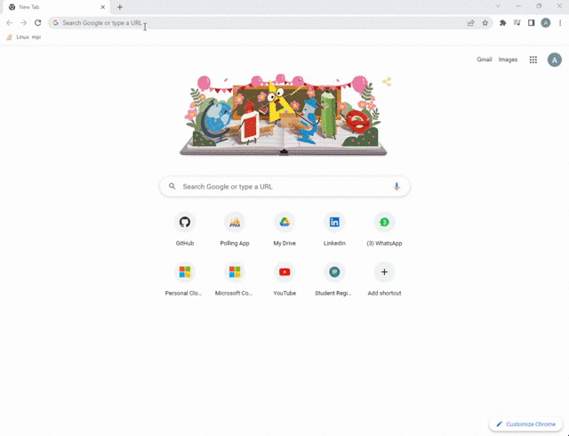

# Polling App


### Description

This is a polling app powered by using pusher API.

### Preview



##Special Features

 Pusher subscription_count feature is implemented in main.js file. Const named totalSub is used to implement this feature there.

## Set up Project Requirements

You need following requirement to setup your project:

### Prerequisites

- Node (https://node.org/)

### Install Project

Here are the steps to be taken after that:


1. Clone the repository:

git clone https://github.com/AniqJaved/pollingapp.git


2. Change directory:
    ```bash
    cd pollingapp
    ```
3. Install dependencies
    ```bash
    npm install
    ```
4. Start the server
    ```bash
    npm run dev
    ```
5. Change directory and add connection string
    ```bash
    cd config/db.js
    ```
    Add connection string in config/db.js file


## Resources

- [Pusher](https://pusher.com/)
- [Readme.so](https://readme.so/editor)
